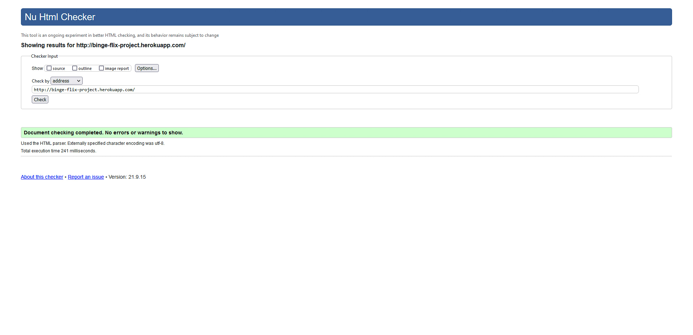

# **Binge-Flix**


This is my 3rd Milestone Project for the Code Institute. It is a fully responsive site.

Binge-Flix is an App to allow its user's to keep rate and review TV Series from all streaming platforms.
Each user will have their own profile created upon registering. A user can edite or delete their own personal ratings or reviews.

The live version can be found [here.](http://binge-flix-project.herokuapp.com)


:file_folder: Table of Contents
======

**<details><summary>UX</summary>**
* [_Target Users_](#target-users)
* [_User Stories_](#user-stories)
</details>

**<details><summary>Features</summary>**
* [_Existing Features_](#existing-features)
* [_Features for the future_](#future-features)
</details>

**<details><summary>Technologies</summary>**
* [_Languages_](#languages)
* [_Libraries and frameworks_](#libraries-and-frameworks)
* [_Wireframes_](#wireframes)
* [_Tools_](#tools)
</details>

**<details><summary>Testing</summary>**
* [_HTML Validation_](#html-validation)
* [_CSS Validation_](#css-validation)
* [_JavaScript Validation_](#javascript-validation)
* [_Python Validation_](#python-validation)
* [_Website Compatability_](#website-compatability)
* [_Device Responsiveness_](#device-responsiveness)
</details>

**<details><summary>Deployment</summary>**
* [_How to deploy on Heroku_](#how-to-deploy-on-heroku)
* [_How to clone the Repo_](#how-to-clone-the-repo)
* [_Connect to MongoDB_](#connect-to-mongodb)
</details>

**<details><summary>Issues</summary>**
* [_Bugs_](#bugs)
</details>

**<details><summary>Credits</summary>**
* [_Code_](#code)
* [_Media_](#media)
* [_Other_](#other)
* [_Acknowledgements_](#acknowledgements)
</details>
<br>

:bust_in_silhouette: UX
======


A responsive App. Allowing the user to review and rate TV series across all platforms. The 
user will also have their own profile, and record of reviews and ratings.

### **Target Users**  

* Users who like watching TV series
* Users who like to review TV seires
* Users who like to rate TV series
* Users who like to recomend what to watch
* Users Looking for new Series to watch and are looking for a recomendation 

### **User Stories**

* As a User I want a clean and clear Website
* As a User I want to be able to navigate around the site with ease
* As a User I want to be able to use the website with ease with clear messages
* As a User I want to be able to create an account
* As a user I want to find my account history
* As a User I want to edit my reviews
* As a User I want to delete my reviews
* As a User I want to be able to update my profile
* As a User I want to like or dislike reviewed shows
* As a User I want to be able to search shows by keywords
* As a User I want to able to use the site on different platforms

<div align="center"><a href="#top">🔝</a></div>  

The Wireframes can be found [here](https://www.figma.com/file/5F65S2c3ZgqiyoLLFoxLgj/Binge-Flix?node-id=0%3A1).


:electron: Features
======


### **Exsisting Features**

1. **landing Page** 
    * Title
    * About
    * Log In Button
    * Link to register if no account held
2. **Log In Page**
    * Form
    * Submit Button 
3. **Register Page**
    * Form for full details for profile
    * Submit Button
4. **My Profile** 
    * Shows what reviews the user has made
    * Edit Button on each show card
    * Delete Button on each show card
5. **Shows Trending Page**
    * Where the User can See all shows 
    * Users can see who posted each review
    * The user can search for reviews by show name
    * The user can like a review
    * the user can dislike a review 
7. **Add a Show Page**
    * Form for adding a show
    * Several Dropdown menus to choose platforms, genres and seasons
    * Submit Button
8. **Edit a Show Page**
    * Form for editing a show
    * Several Dropdown menus to choose platforms, genres and seasons
    * All Previous information is shown in the form that user previously entered
    * Submit Button
8. **Nav Bar**
    * So User can easily navigate the site
9. **Footer**
    * links to Social Media
    * Copyright
10. **Safety Modal**
    * Appears when the user is about to make changes, makes sure user is happy to proceed
11. **Search Bar**
    * User can search for shows by name

### **Future Features**
To be added in the future:

* Users to be able to comment on other users reviews
* Users to like or dislike those comments
* Users can click on the show to watch it.(Providing user has the appropriate apps)
* Users can link to sites like IMBD or wikipedia
Possibly link to IMBD API

<div align="center"><a href="#top">🔝</a></div>

:computer: Technologies
======


### **Languages**


### **Libraries & Frameworks**
* [Flask](https://flask.palletsprojects.com/en/2.0.x/)
* [jQuery](https://jquery.com/)
* [PyMongo](https://pymongo.readthedocs.io/en/stable/)
* [Jinja](https://jinja.palletsprojects.com/en/3.0.x/)
* [Materialize](https://materializecss.com)
* [Werkzeug](https://werkzeug.palletsprojects.com/en/2.0.x/)

### **Wireframes**
* [Figma](https://www.figma.com/file/5F65S2c3ZgqiyoLLFoxLgj/Binge-Flix?node-id=0%3A1)

### **Tools**
* [MongoDB](https://www.mongodb.com/) The Database
* [Heroku](https://heroku.com) Host for deployed site
* [GitHub](https://github.com) Repository
* [Gitpod](https://gitpod.io) Development
* [Freepik](https://www.freepik.com) Homepage Image
* [coolor.co](https://coolors.co) Color Palattes
* [Lightroom](https://lightroom.adobe.com/)

<div align="center"><a href="#top">🔝</a></div>

:stethoscope: Testing
======


### **User Stories Testing**

1. As a User I want a clean and clear Website :white_check_mark:
2. As a User I want to be able to navigate around the site with ease :white_check_mark:
3. As a User I want to be able to use the website with ease with clear messages :white_check_mark:
4. As a User I want to be able to create an account :white_check_mark:
5. As a user I want to find my account history 
    * This is the the User shows page showing what shows they added :white_check_mark:
6. As a User I want to edit my show reviews :white_check_mark:
7. As a User I want to delete my show reviews :white_check_mark:
8. As a User I want to be able to update my profile :x:
    * The user can edit and delete shows. No need to edit a profile.
9. As a User I want to like or dislike reviewed shows :white_check_mark:
10. As a User I want to be able to search shows by keywords  :white_check_mark:
    * Can be searched by searching for a name
* As a User I want to able to use the site on different platforms :white_check_mark:

### ***HTML Validation***

[W3C Markup Validator](https://validator.w3.org/)


* 0 Errors found
* 1 Warning found

* Fixed by removing section and replcing with a div on the base.html page.



### ***CSS Validation***

[W3C Jigsaw](https://jigsaw.w3.org/css-validator/)


* No Errors found
* 1 Warning about the font import(IGNORED)

### ***JavaScript Validation***

[JShint](https://jshint.com/)


* 0 Errors found
* 2 Warnings which cannot be changed as will break the code.

### ***Python Validation***

[PEP8online](http://pep8online.com/)


* 0 Errors found
* 1 warning about white space on line 3. 

### ***Website Compatability***

|   	|   **Chrome**	|   **FireFox**	|   **Opera**	|   **Edge**	|
|---	|---	        |---	        |---	        |---	        |
|   **Forms**	|   &#9745;	|   &#9745;	|   &#9745;	|   &#9745;	|
|   **Text**	|   &#9745;	|   &#9745;	|   &#9745;	|   &#9745;	|
|   **Images**	|  &#9745; 	|  &#9745; 	|  &#9745; 	|   &#9745; |
|   **Links**	|   &#9745;	|   &#9745;	|   &#9745;	|   &#9745;	|
|   **Buttons**	|   &#9745;	|   &#9745;	|   &#9745;	|   &#9745;	|


### ***Device Responsiveness***

|   	|   **<1200px**	|   **<1000px**	|   **<800px**	|   **<350px**	|
|---	|---	        |---	        |---	        |---	        |
|   **Forms**	|   &#9745;	|   &#9745;	|   &#9745;	|   &#9745;	|
|   **Text**	|   &#9745;	|   &#9745;	|   &#9745;	|   &#9745;	|
|   **Images**	|  &#9745; 	|  &#9745; 	|  &#9745; 	|   &#9745; |
|   **Links**	|   &#9745;	|   &#9745;	|   &#9745;	|   &#9745;	|
|   **Buttons**	|   &#9745;	|   &#9745;	|   &#9745;	|   &#9745;	|


<div align="center"><a href="#top">🔝</a></div>

:computer:  Deployment
=====


### ***How to Clone the Repo***

If you want to clone the repository into a local file you can by:

 1. Find the repo in github.
 2. Click the button "code".
 3. Copy the URL by clicking on the clipboard.
 4. In the IDE of your choice open gitbash.
 5. Change the current working directory to the location where you want the cloned directory to be made.
 6. Type git clone, and then paste the URL copied from Github
 7. Press enter and the local clone will be created.
 8. After opening the folder you should create a new file in the root directory, name it env.py
 9. In env.py you can set your environment variables.  
    ``` import os
      import os

      os.environ.setdefault("IP", "<your value>")
      os.environ.setdefault("PORT", "<your value>")
      os.environ.setdefault("SECRET_KEY", "<your value>")
      os.environ.setdefault("MONGO_URI", "<your value>")
      os.environ.setdefault("MONGO_DBNAME", "<your value>")

10. In terminal window of your IDE type: pip3 freeze -- local > requirements.txt
11. In termial window of your IDE type: python app.py > Procfile 

### ***How to Deploy on Heroku***

The website is hosted and deployed by [Heroku](https://www.heroku.com/home).
Everything is deployed from the master branch and updates automatically whenever the branch is updated in GitHub.

Before deploying to Heroku. Please ensure the env.py file, requirements.txt and the procfile have been set up on your local IDE.

1. Log or register into Heroku
2. Go to your dashboard.
3. Click on the "New"  -> "Create new app" button located right under the navbar.
4. Choose a unique name for your app. (Once a name is taken, it cannot be used again.)
5. Choose a region (preferably close to where you are located. I chose Europe).
6. Next you will see the overview page of your app.
7. Click on the "Deploy" button.
8. On "deployment method" connect to github.
9. On "app connected to GitHub" select the appropriate repo.
10. Click on Settings tab.
11. Reveal Config vars.
12. Here we configure the IP, MONGO_DBNAME, MONGO_URI, PORT, SECRET_KEY values (As with the env.py file, these are not not public).
14. Click "Enable Automatic Deploys"
15. Click on "Deploy Branch".
16. Click "View" to launch the app. 

<div align="center"><a href="#top">🔝</a></div>

:biohazard: Bugs
======

* A problem when registering or logging in, there seemed to be connection problems with the database.
    * I realised I used incorrect code for the submit button.

* The like button.
    * I was incorrectly using the $inc operator, I had forgotten the qoutation marks.
    * I also had problems with the like counter resetting when a show had been edited. i fixed this with "$set" before the information that i wanted edited on edit_shows.html.

* On Mobile version the trending page looked cluttered with all the information.
    * I decided to create a new page with for show details. The trending page will just have the title, Image and posted information.

* Issued with non users or non session users being able to edit and delete by changing the URL.
    * Added ```from functools import wraps``` and built a function:
     ```
    def login_required(f):
    @wraps(f)
    def wrapper(*args, **kwargs):
        if "logged_in" in session:
            return f(*args, **kwargs)
        else:
            return redirect("/")

    return wrapper

* And add ```@login_required``` to the appropriate routes.
    * Also added:  
    ```
    if not session.get("user"):
        return render_template("error_handlers/404.html")

    To check if session user is appropiate for that route.

* And of course the usual typos and minor errors that throw you off!!!
    


<div align="center"><a href="#top">🔝</a></div>

:copyright: Credits
======

### **Code**
* Code Institute Backend Developement Task Manager Project by Tim Nelson: I followed along to put in the basics and modified to suit my site.
* [Materialize](https://materializecss.com) For Nav bar, Forms, Footer and geral responsiveness

### **Media**
* AWS: For the stock pictures used by users
* [Am I Responsive](http://ami.responsivedesign.is/)

### **Other**
* [YouTube](https://www.youtube.com/): More videos than i can remember!! But basically to give me extra knowledge when faced with a challenge.
* Stackoverflow: For problem solving.
* [W3 Schools](https://www.w3schools.com/)

### **Acknowledgements**
* My Mentor Precious
* Fatima, Sean, Michael, John & Jo From the Code Institute.
* [Thiago Hardt](https://github.com/ThiagoHardt) For Listening to my moaning and giving advice.
* Daphne and Mike fellow students on slack for

<div align="center"><a href="#top">🔝</a></div>
